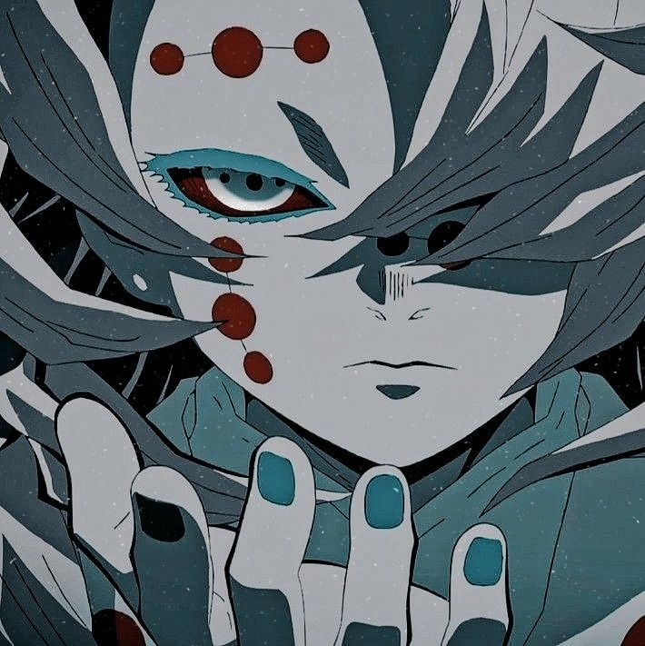
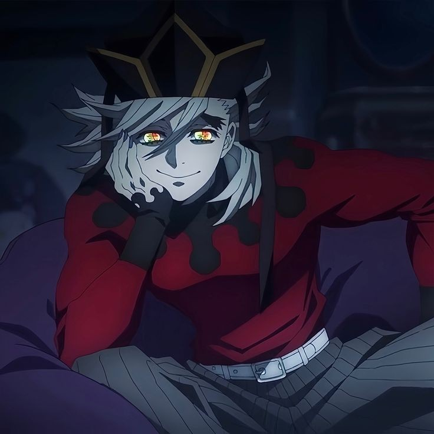

# Demon Slayer 
O anime conta a história de Tanjiro,um bondoso jovem que ganha a vida vendendo carvão. Sua vida muda após sua família ser morta por um oni e sua irmã mais nova se transformar em um deles. Tanjiro então decide se transformar em um caçador de onis para conseguir transformar sua irmã em humana novamente

## CONHEÇA OS PERSONAGENS DE DEMON SLAYER

# Tanjiro kamado

•protagonista do anime
•15 anos
•caçador de onis
•respiração da água/sol

# Nezuko kamado

•irmã mais nova do tanjiro
•14 anos
•oni

# Muzan kibutsuji 

•antagonista do anime
•mais de 10000 anos
•rei dos onis

# Inosuke Hashibara

•amigo do tanjiro 
•15 anos 
•caçador de onis
•respiração da fera

# Rui

•lua inferior 5
•oni

# Kanao tsuyuri

•caçadora de onis
•16 anos 
•respiração das flores

# Douma

•lua superior 2
•oni

# Aoi Kanzaki

•15 anos

# 
